# LLM Usage at Scale

## AI Harness Engineering

### Co-work Agent Team

Challenge: How can I go to bed and my agent teams do work for me reliably?

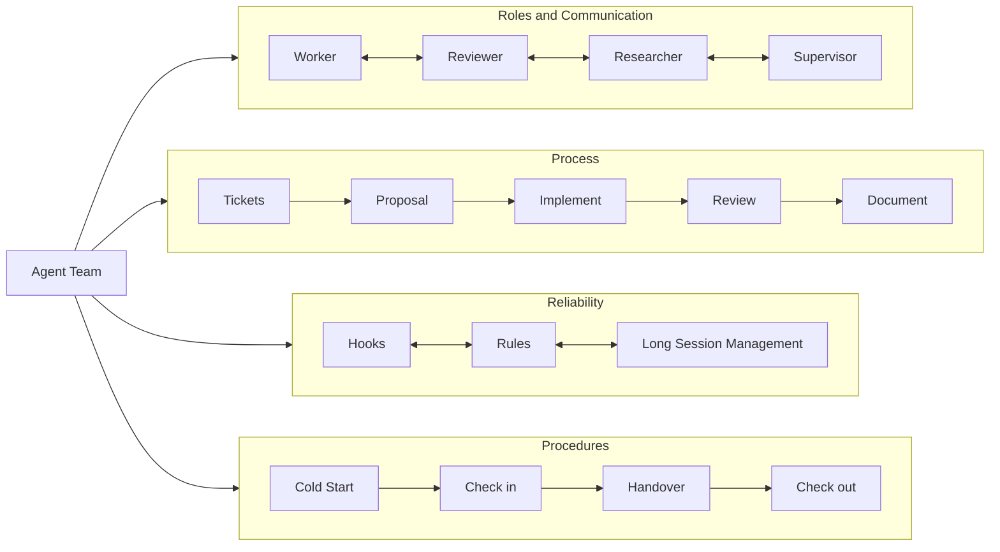

### Skill Management

Challenge: How can I manage skills when there are 50+

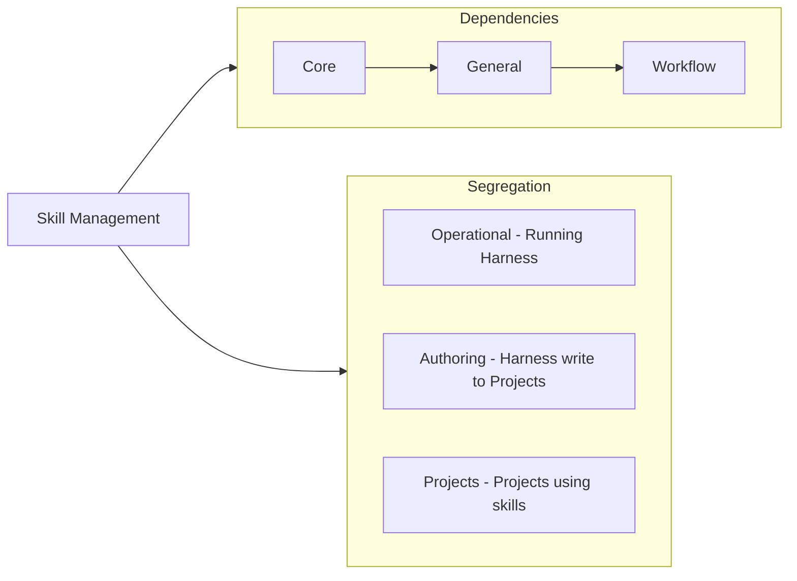

### Skill Optimisation

Challenge: How can we optimize skills, keep it shorter and runs more reliably

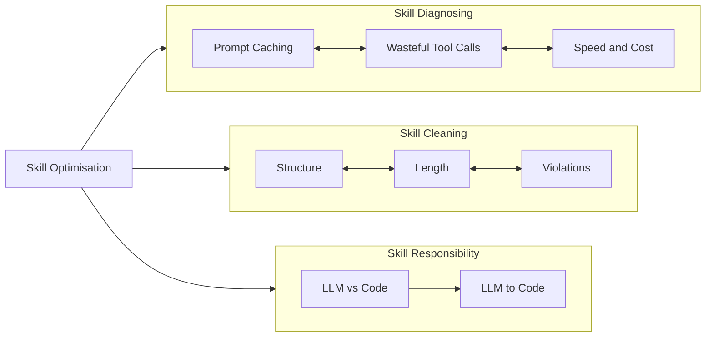

## LLM Processing for Millions of Files

### Whole UK Investment Data Processing

Challenge: How can we process data for an unfamiliar domain (e.g. how do we know if a company received investment?)

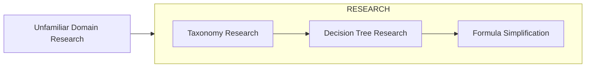

### PDF Discovery and Processing Pipeline

Challenge: Can we make sure we have all the data first

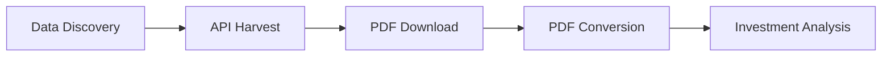

### PDF Extracted Text to Tables (LLM with Code)

Challenge: At 5 min per record, processing millions via LLM is impossible

Visualisation: "Text -> Table"

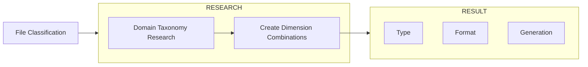

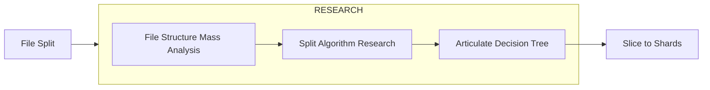

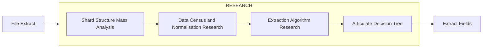

## LLM Summary for Millions of Websites (Scale & Speed)

Challenge: How can we finish processing millions of long text with LLM very fast and accurate

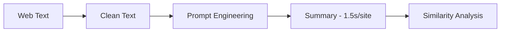

---

## LLM Assisted Automation Pipelines

### UI and Test Automation at Scale

Challenge: How can I handle UI and Test Automation at Scale, and adapt UI changes in isolation

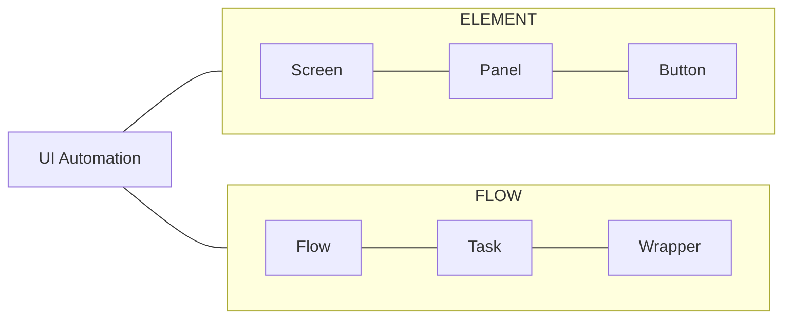

Application:

- Automation Testing: How can I handle Playwright Test Automation at Scale, especially when app is under dev
- Game Play: How can I collect daily game reward automatically

### Videos to Knowledge Base

Challenge: How can I consume knowledge quickly if a video has content relevant to me

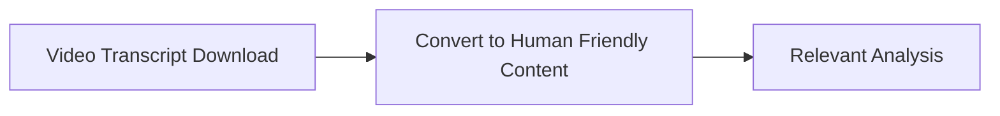

### Automation - Handle UK Tax Return

Challenge: Handle Tax Return Automatically with Accuracy and Idempotency

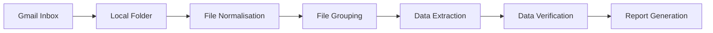

---

## 10 Million Records Search

### Similarity Search at Scale (Vector DB)

Challenge: How can we create a vdb that stores >10 million records?

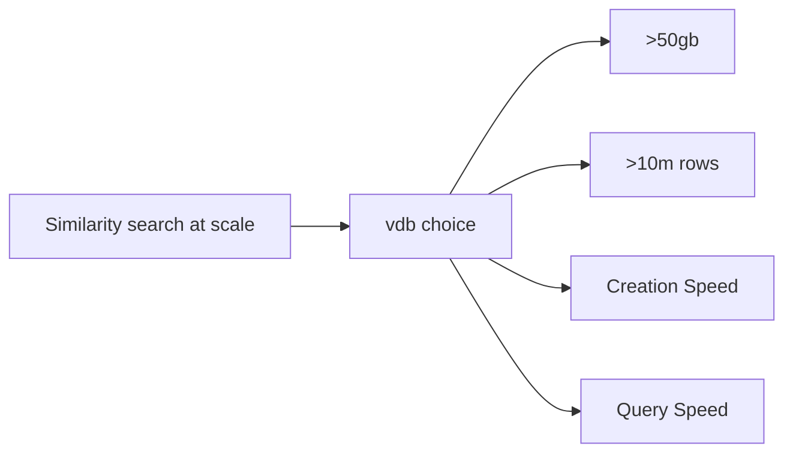

### Smart Search at Scale (Micro Services)

Challenge: How can we handle Smart Search with >10 million records

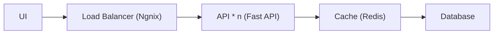

---

## Knowledge Sharing

Content Creator: 200+ Videos, 6k+ Subscribers (mid 2026)
