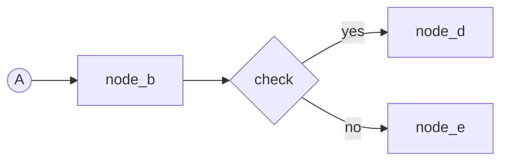

# coding

- [ALWAYS] avoid comments if not absolutely required. If it's a decision/reasoning for a skill, put into `<my_skill>/_meta/decision.md`. If not, avoid.

# unit__diagram__flowchart

Flowchart conventions to improve the default

## Source layout

- **No mixing** - Nodes first, then arrows - never both on one line.
- **Nodes** - A node line holds exactly one node definition.
- **Arrows** - Carry bare ids. One run per line.
    - Chain ids while the path does not branch.
    - A branch id ends the run, then begins each branch line.



## Mermaid safety

- [ALWAYS] run a syntax check on the diagram after creating it - render it in a mermaid viewer or run a mermaid parser before the diagram counts as done.
- Never put `;` in a label.
- Never put angle brackets (`<` or `>`) in a node label.
- Use `<br/>` for line breaks.
- Spell a dash as `-` - an em dash or en dash is not on a keyboard.
- Spell `+` as `plus`.
- Spell `&` as `and`.

---

# unit__doc__forward_desired

WHEN a document states how things ARE, THEN write the desired forward state, never a correction of how they were.

The test: delete every mention of the previous state - does the document still do its job?

## Rules

- [forward, no-stale-content, desired, correct] - state what is true now. Nothing about what it replaced, how it got here, who changed it, or when.
- [no-changed, no-corrected] - avoid `how we did it, and later we changed it to ...`; state the `...` alone.
- [consolidate-not-append] - merge new truth into the existing statement, never stack a new layer on top.
- [surviving-constraint] - [IF] history guards a trap someone would re-attempt, [THEN] keep the constraint, drop the episode.

---

# unit__response__ASD-STE100

In technical context, if user does not understand, use ASD-STE100 Simplified Technical English.

(Follow the description)

---

# unit__response_to_user

When writing a doc or response for user to read, use diagrams and tables. Avoid paragraphs unless it's just one line to about the context.

## Format

- Diagram to show flows: [IF] output to console then use ASCII flowchart, [IF] output to file, use Mermaid flowchat
- Tree: to show tree structure
- Table: to show content that can have tabular relationship
- (keep paragraphs extreme minimum)

### Trees

```
<name (flat)>
|-- item 1
|-- item 2
+-- item 3

<name (nested)>
|
|-- level 1
|   |-- level 2
|   +-- level 2
|
+-- level 1

<name (with input and output)>
|-- [in]: a), b), ...
|-- [task]:
|-- [out]: a), b), ...
```

---

# unit__rule__make_concise

Minimize rule files while preserving meaning and unambiguity

## Rule

Given a rule file, or a user's description of a rule, produce a version that is:

- **Shorter** - keep only what is needed to apply the rule correctly.
- **Better** - same meaning, better written.
- **Unambiguous** - a reader cannot misread it.

When the user's intent is unambiguous, output must be shorter than the input.
