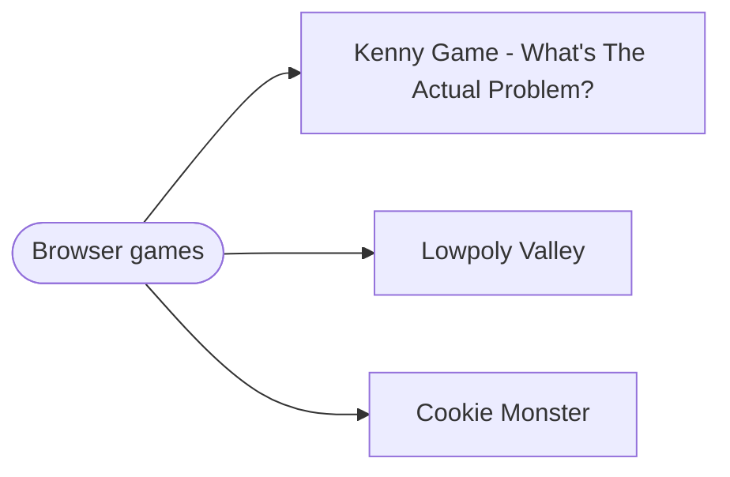
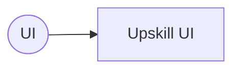

# Little Games

```mermaid
flowchart LR
    B(["Browser games"])
    K["Kenny Game - What's The Actual Problem?"]
    L["Lowpoly Valley"]
    C["Cookie Monster"]
    B --> K
    B --> L
    B --> C
    click K "https://mingzilla.github.io/mingzillastudio/demo/kenny-game/"
    click L "https://mingzilla.github.io/mingzillastudio/demo/lowpoly-city/"
    click C "https://mingzilla.github.io/mingzillastudio/demo/cookie-monster/"
```

# UI Design

```mermaid
flowchart LR
    UI(["UI"])
    UPSKILL["Upskill UI"]
    UI --> UPSKILL
    click UPSKILL "https://mingzilla.github.io/mingzillastudio/demo/upskill_ui/"
```
